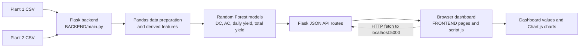

# Solar Supply Prediction

A Flask and JavaScript dashboard for exploring historical solar generation data from two plants. It trains Random Forest models for power and yield values, exposes results through a Flask API, and displays charts and trends in the browser.

## Features

- Predicts DC power, AC power, daily yield, and total yield.
- Shows yearly averages and comparisons between the two plants.
- Displays illustrative projections and growth trends through 2030.
- Provides a browser dashboard with light and dark themes.

## Project Architecture

The project has three main layers:

1. **Data:** Two CSV files in `BACKEND/` provide the historical generation records.
2. **Backend and API:** `BACKEND/main.py` loads and combines the data, prepares model features, trains Random Forest regressors, and serves JSON through Flask routes.
3. **Frontend:** Pages and scripts in `FRONTEND/` request API data from the local Flask server and display it in dashboard charts and summaries.



At startup, the backend reads the CSV files and trains the models. The frontend then calls routes such as `/prediction`, `/yearly/dc`, and `/comparison` to populate the dashboard.

## Project structure

`BACKEND/` contains the Flask application and the two plant generation CSV files. `FRONTEND/` contains the landing page, dashboard, project information page, styles, scripts, and logo.

## Requirements

Python 3.10 or newer is recommended. From the repository root, create and activate a virtual environment, then install the backend packages:

```powershell
python -m venv .venv
.\.venv\Scripts\Activate.ps1
python -m pip install Flask Flask-Cors matplotlib numpy pandas scikit-learn
```

## Run locally

Start the Flask backend from the repository root:

```powershell
python BACKEND/main.py
```

The API runs at `http://localhost:5000`. Keep that terminal open, then open `FRONTEND/frontpage.html` in a browser and navigate to the dashboard. The frontend calls the backend at `http://localhost:5000`.

## API routes

- `/prediction` — sample predictions and the 2030 growth estimate
- `/yearly/dc`, `/yearly/ac`, `/yearly/daily`, `/yearly/total` — yearly averages
- `/comparison` — average metrics for both plants
- `/future/dc`, `/future/ac`, `/future/daily`, `/future/total` — projected values
- `/trends` — annual growth estimates and trend labels

## Notes

The backend derives temperature and irradiation features from power values as placeholders. Long-term growth rates and prediction inputs are illustrative, so projections should not be treated as operational forecasts. The models train when the backend starts.
